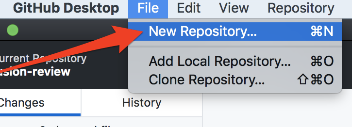
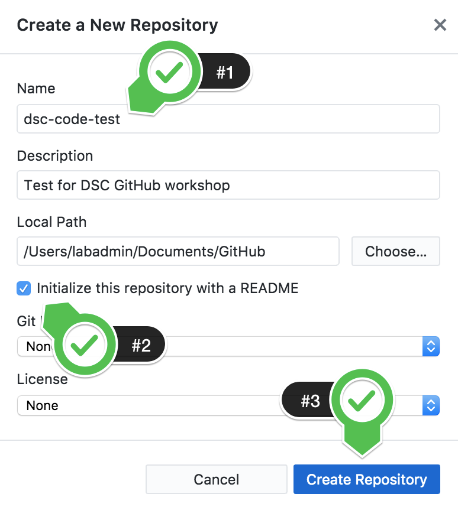
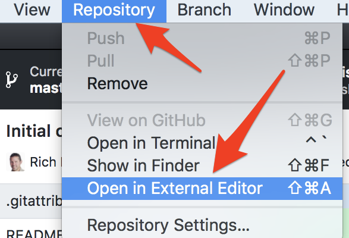
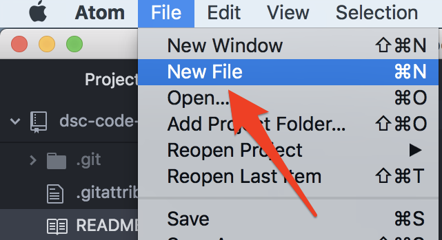
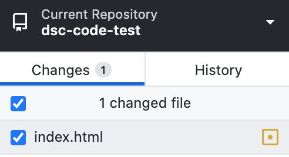
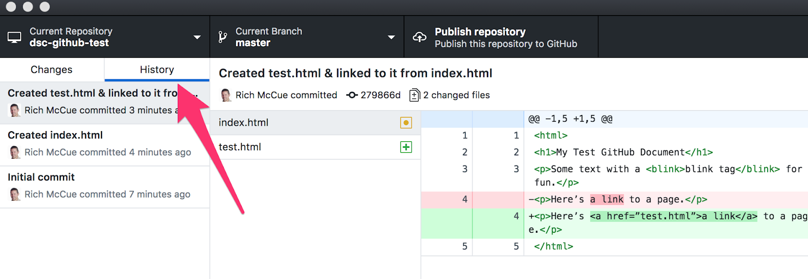
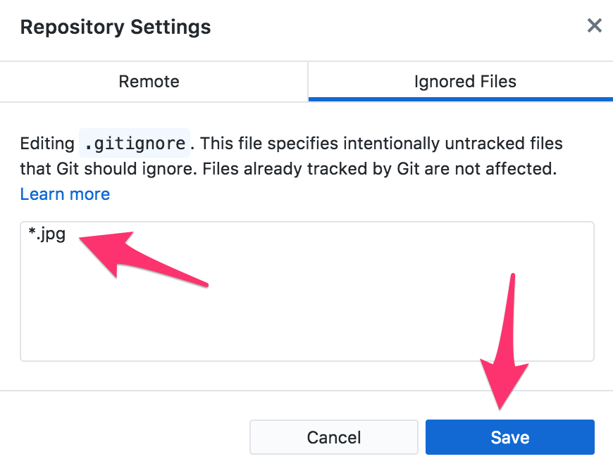

# Getting Started

If you and your group have any questions, or get stuck as you work through this in-class exercise, please ask the instructor for assistance.  Have fun!

1.  If you haven’t already, please [create an account](http://github.com){:target="_blank"} for yourself.
2.  [Install GitHub Desktop](https://desktop.github.com){:target="_blank"} on your laptop.

    

3.  [Install the Atom text editor](https://atom.io/){:target="_blank"} on your laptop.
4.  Create a new local repository in GitHub Desktop:
    -   Start by selecting the **File** menu then, **New Repository...**
    
    
    
    -   Finish creating the new repository by filling in the Name, checking the Initialize with README.
    -   Click on **Create Repository**.

    
    

5.  Add files, commit changes in GitHub Desktop:
    -   Next, open up the Atom text editor, by going to the **Repository** menu, then **Open in External Editor** -or- **Open in Atom**.  **Note:** _You can use any text editor you’d like, but in this tutorial, we will be using the Atom editor._
    -   Your Atom text editor should open and have two files that were automatically generated when you created your test repository: **.gitattributes** & **README.md**
    
    
    
    -   Create a new file for your GitHub repository in Atom by selecting **File** and then **New File**.
    -   Let’s save the file and give it a name by selecting **File** then **Save**. Call the file **“index.html”** (without the quotation marks). Your new file will show up in the left hand navigation of Atom.
    
    
    
    -   Add the following HTML code to your index.html file:
    
    ```
    <html>
    <h1>My Test GitHub Document</h1>
    <p>Some text with a <blink>blink tag</blink> for fun.</p>
    <p>Here’s a link to a page.</p>
    </html>
    ```
    
    
    
    -   Save the file in Atom, and then go back to the GitHub Desktop program and you’ll notice that there is a blue dot beside the “Changes” tab. When you change one or more files, all the changed files will be listed below, ready for you to commit them, and track the changes you make between commits.
    -   Let’s start to track the changes in index.html by committing it in GitHub Desktop. At the bottom left of GitHub Desktop you’ll see **Summary / Update** field; fill it out with a short description (e.g.: “Just created index.html”)  and then press the blue **Commit to master / Commit to main** button below.
    
    
    
    -   Let’s add another file to the repository. In the Atom editor, selecting **File** and then **New File**.
    -   Save the file and give it a name by selecting **File** then **Save**. Call the file **“test.html”**.
    -   Add the following HTML code to **test.html** and save it:
    
    ```
    <html>
    <h1>Test Document</h1>
    <p>A document to link to.</p>
    </html>
    ```
    
    -   Edit the 4th line of the **index.html** file so that reads as follows then save the file:
    
    ```
    <p>Here’s <a href=”test.html”>a link</a> to a page.</p>
    ```
    
    
    
    
    -   Now go to GitHub Desktop, and click on the **Changes** tab, add a short summary of the changes you made (e.g.: “Created test.html & linked to it from index.html”), and press the blue **Commit to master** / **Commit to main** button.
    -   Try deleting the “blink” tags in the **index.html** file, and then “commit” the changes. If you have any problems with this, ask the person leading the workshop for a hand.
    
    

6.  Explore change history & ignore files:
    -   To review changes to files, click on the **History** tab in GitHub Desktop, and select the commits that you would like to look at.
    
    
    
    
    -   If you want to ignore some files (e.g.,image files,which GitHub can’t track changes in), you can do that in GitHub Desktop by going to the **Repository** menu, and selecting **Repository Settings**. Then click on the **Ignored Files** tab. Enter: <b>&ast;.jpg</b> in the dialog box, then press the **Save** button. Commit the change you just made to the **.gitignore** file.
7.  Congratulations! Next you can work through the handout on how to use GitHub for collaboration with others.

[NEXT STEP: Collaborating](act-2.html){: .btn .btn-blue }
