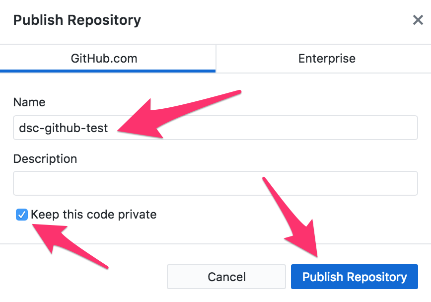
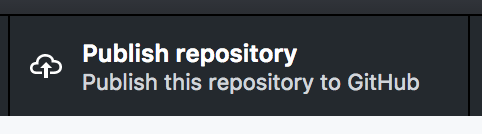
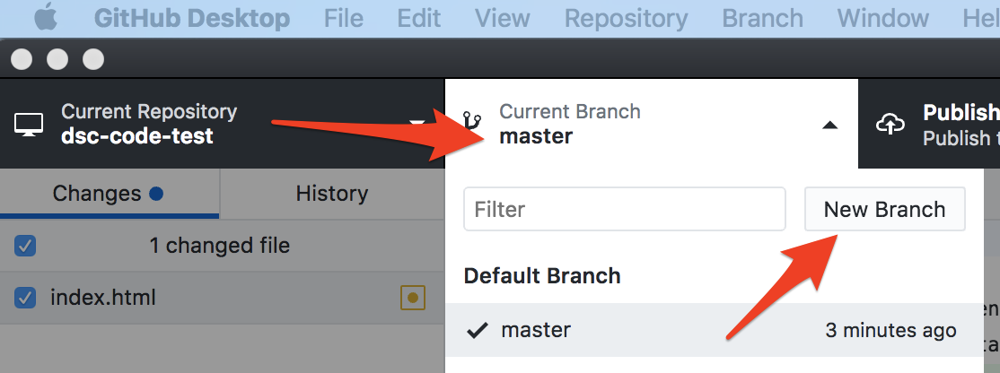

# Collaborating

If you and your group have any questions or get stuck as you work through this in-class exercise, please ask the instructor for assistance.  Have fun!

1.  If you haven’t already, please either work through the _Version Control with GitHub #1 Workshop - Getting Started_ handout, or launch GitHub Desktop and open a repository you’ve already created.

    

2.  Publish your repository to GitHub:
    -   In GitHub Desktop, press the **Publish repository** button at the top of the program.
    
        
    
    -   Verify the name of the repository, **deselect** the **“Keep this code private”** checkbox, and then press the blue **Publish Repository** button.
    -   A copy of your repository is now on the GitHub website. Go to [https://github.com/](https://github.com/){:target="_blank"} and log on to see your repository there.
    
    <button onclick="toggle('gif1')">Show / Hide Animation </button>
    

    
    

    
    
3.  Branching, Pull requests, & Merges:
    -   In the Atom text editor, add a line to the **index.html** file (just above **</html>** tag): `
Here is my "goat" branch test.
`
    -   Save your changes to **index.html**
    -   Open GitHub Desktop, and select the **Changes** tab.
    -   Instead of committing to master like we’ve done before, let’s make a branch by selecting the **Current Branch** drop down on the top navigation, and clicking on the **New Branch** button.
    
    
    
    -   Call this branch **“goats”**, and then click on the blue **Create Branch** button.
    -   Lastly, we need to commit our new goat branch by entering a summary of what we’ve done (e.g. “Create a goat branch”) in the Summary field at the bottom left of GitHub Desktop, and then press the blue **Commit to goats** button.
    -   Lastly, publish your repository again to GitHub by pressing the **Publish branch** button in GitHub Desktop.
    
    <button onclick="toggle('gif2')">Show / Hide Animation </button>
    

    
    

    
    
    -   Let’s take a look at a map of your newly branched repository on the GitHub website: [http://github.com](http://github.com){:target="_blank"}
    -   Click on the **Code** tab up top, and then the **branches** tab in the middle of the screen.

    

4.  To participate in another project hosted on the GitHub website, you’ll need to Clone or Download the repository:
    -   Go to [this URL](http://bit.ly/scholar-py){:target="_blank"} and then select the green **Clone or download** dropdown, and then press the **Open in Desktop** button.
    -   GitHub Desktop should have launched, and you’ll see a copy of the repository on your laptop now.
    -   You can now make changes locally and submit pull requests for this project back to the GitHub hosted repository if you have anything to add to this project.
    -   **Note:** _Please don’t submit any pull requests for this project unless you have a real patch or feature upgrade to suggest._

[NEXT STEP: Collaborating With Conflict](act-3.html){: .btn .btn-blue }
