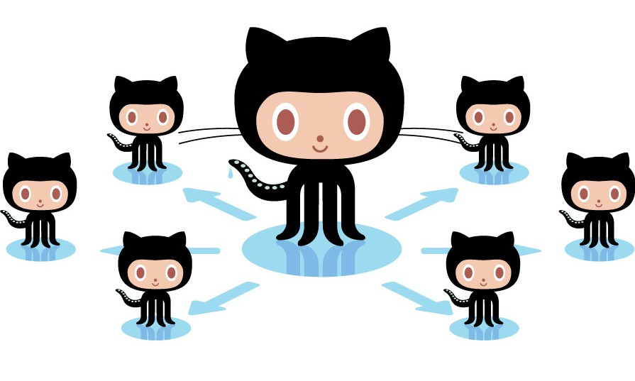
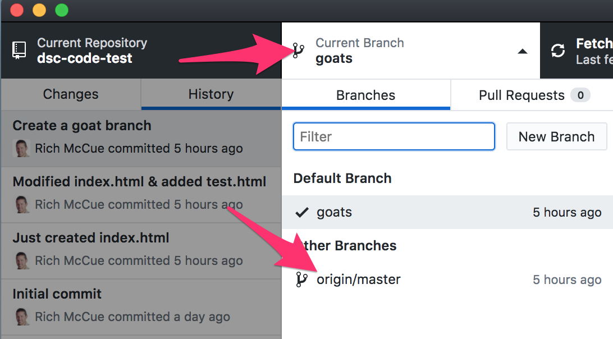
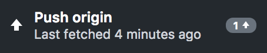
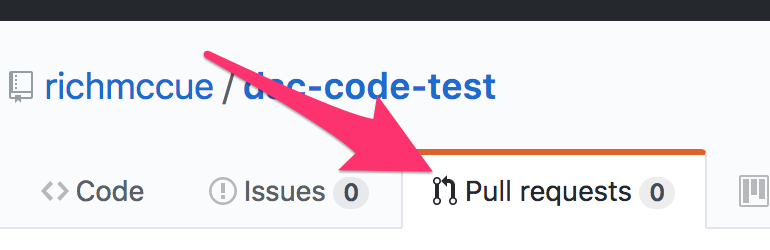
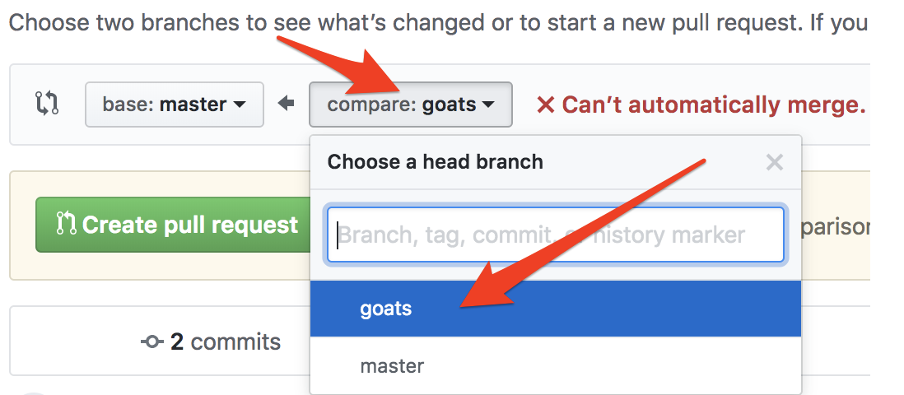

# Collaborating With Conflict

If you and your group have any questions, or get stuck as you work through this in-class exercise, please ask the instructor for assistance.  Have fun!

1.  If you haven’t already, please work through the _Version Control with GitHub #1 Workshop - Getting Started_ handout -and- _GitHub #2 Workshop - Collaborating._
2.  Let’s create a conflict in the index.html file so that we can later resolve it:
    -   In your Atom editor change the 2nd line of code to: `<h1>My Test GitHub Document Too</h1>`
    
    
    
    -   Save and then in GitHub Desktop commit the change under the Changes tab.
    -   In Github Desktop, click on the **Current Branch** tab on the top navigation bar, and then select **master / main**. If you were watching your Atom editor as you selected **master / main**, you would have seen the text in the **index.html** file change as you switched from the **goats** branch, back to the **master / main** trunk.
    -   Back in your Atom editor change the 2nd line of code in index.html to: `<h1>My Test GitHub Document 2</h1>`
    -   Save and then in GitHub Desktop “commit the change” you just made.
    -   Now push those changes to **master / main** trunk to the GitHub website by pressing the “Push origin” button at the top of GitHub Desktop.
    
    
    
    -   Next click on the **Current Branch** tab on the top nav bar, and select **goats**. Push the change to the **goat** branch to the GitHub website by selecting **Push origin**.
    -   We just created a conflict in the **index.html** file between both the **master** and **goats**.
    
    
    
    
3.  Let’s resolve the conflict now:
    -   Open up [https://github.com](https://github.com){:target="_blank"} and navigate to your project. Click on the **Pull requests** tab, and then press the green **New pull request** button on the right of the screen.
    
    
    
    -   Next select the **compare: master** drop down, and select, **compare: goats** from the menu. Notice that to the right of the drop downs it says, <b><mark style="color:red;">“Can’t automatically merge...”</mark></b>, but you can still make a pull request by pressing the green, **Create pull request**.
    -   Add a descriptive title (E.g. **“Merging "Too" and "2" in the index.html file”**), and then press the green **Create pull request** button.
    -   On the next web page there is some text that says, “This branch has conflicts that must be resolved.”  Press the grey button to the right of that text that says **Resolve conflicts**.
    -   Now edit the text to resolve the conflict between the versions of **index.html** on this page, and click **Mark as resolved**.
    -   Next click on the green **Commit merge** on the top right.
    -   Lastly on the next page that comes up, select the green **Merge pull request**, and then **Confirm merge**. Done!
4.  Let’s bring up the network map of the changes you’ve made in your repository.
    
    
    
    -   Let’s take a look at a map of your newly un-conflicted repository on the [GitHub website](http://github.com){:target="_blank"}
    -   Click on the **Code** tab up top, and then the **branches** tab in the middle of the screen.
5.  Congratulations! You’ve successfully resolved a conflict in GitHub Desktop!

[NEXT STEP: Binary Files - DOCX, JPG & More](act-4.html){: .btn .btn-blue }
