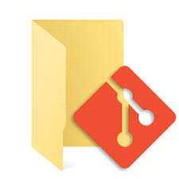
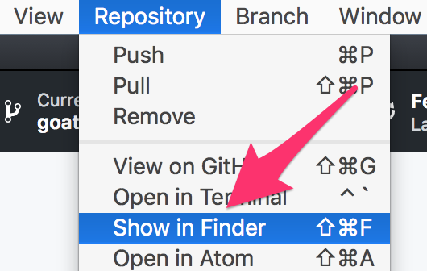
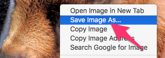

# Binary Files - DOCX, JPG & More

GitHub can not only help you manage code or text based project, but also allows for version control of binary files like Word documents or image files. If you have any questions, or get stuck as you work through this exercise, please ask the instructor for assistance.

1.  If you haven’t already, go to [http://github.com](http://github.com){:target="_blank"} and create an account for yourself.
2.  If you haven’t already, [install GitHub Desktop](https://desktop.github.com){:target="_blank"} on your laptop.
3.  On your laptop open up Microsoft Word or another word processor.
4.  If you haven’t already, please either work through the _Version Control with GitHub #1 Workshop - Collaborating_ handout.
5.  Let’s add two binary files to your repository, and then commit changes in GitHub Desktop:
    -   First in GitHub Desktop, make sure you are in the **master / main** branch, and that you are in sync with your GitHub repository by pressing the **Fetch origin** button.
    
    
    
    -   Open up the GitHub project folder on your local hard drive by going to the **Repository** menu, then if you have a Mac **Show in Finder**, or on a Windows computer, **Show in Explorer**.
    -   In Microsoft Word (or another word processor) open a blank document, type a line of text into it, and then save the file in the directory that your Git repository is in. For example on a mac the path to the new Word file in the Git repository is:
    
    ```
    /Users/UserName/Documents/dsc-code-text/JustTesting.docx
    ```
    
    -   Let’s start to track the changes in **JustTesting.docx** by committing it in GitHub Desktop. At the bottom left of GitHub Desktop you’ll see **Summary** field; fill it out with a short description (e.g.: “Just created a test word document”)  and then press the blue **Commit to master / Commit to main** button below.
    
    
    
    -   Let’s add another file to the repository:
        
        
        
        -   Open the following web page: [http://bit.ly/little-goat](http://bit.ly/little-goat){:target="_blank"}
        -   Download the JPG image to your hard drive by right mouse clicking on the image, and selecting **Save Image As…** and save it to the folder that contains your Git repository.
    -   Now go to GitHub Desktop, and click on the **Changes** tab. You may notice that your **goat.jpg** file is not there because you added <b>&ast;.jpg</b> to your **.gitignore** file.
    -   In your Atom editor, open **.gitignore**, and remove <b>&ast;.jpg</b> from the file. Save the file.
    -   Go back to GitHub Desktop, click on the **Changes** tab, and then add a short summary of the changes you made (e.g.: **“Added a pic of a miniature goat”**), and press the blue **Commit to master / Commit to main** button.
    -   Let’s push these new files to your GitHub hosted repository, by pressing the **Push origin** button on the top navigation bar. This may take a minute because of the side of the goat.jpg file.
    
    
    
6.  Make changes to your Word document and optionally the JPG file:
    -   Open the document you saved in your Git repository (e.g. **JustTesting.docx**), add some text to it and then save it.
    -   Go to GitHub Desktop, and click on the **Changes** tab, add a short summary of the changes you made (e.g.: “Added a line to the document”), and press the blue **Commit to master / Commit to main**.
    -   **OPTIONAL:** Edit the JPG image and commit the change in GitHub Desktop.
    -   Push these changes to your GitHub hosted repository, by pressing the **Push origin** button on the top navigation bar.
7.  You can checkout all the files and changes you’ve made to your online Git repository by going to [https://github.com](https://github.com){:target="_blank"} and signing in to your account.
8.  Congratulations, you’ve added, committed and pushed two new binary files to your local and online Git repositories!

[NEXT STEP: RStudio Integration](act-5.html){: .btn .btn-blue }
