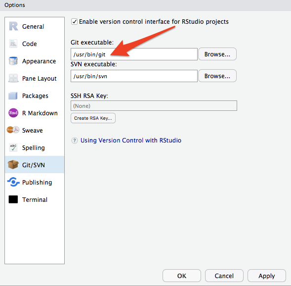
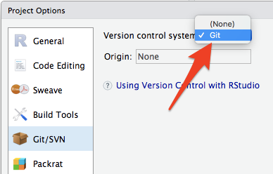
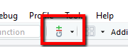
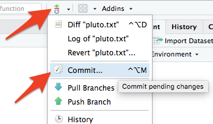
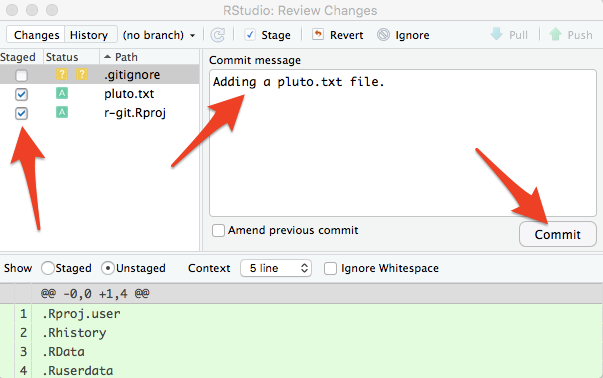
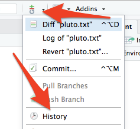
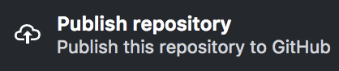

# RStudio Integration

RStudio with GitHub version control integration allows us to track the development of a project over time, revert to previous versions, and to collaborate with others. If you have any questions or get stuck as you work through this exercise, please ask the instructor for assistance.

1.  If you haven’t already, go to [http://github.com](http://github.com){:target="_blank"} and create an account for yourself.
2.  If you haven’t already, [install GitHub Desktop](https://desktop.github.com){:target="_blank"} on your laptop.
3.  If you haven’t already, [install the free version of RStudio](https://www.rstudio.com/){:target="_blank"} on your laptop.
4.  Configure RStudio to use GitHub:
    
    
    
    -   Go to the top menu and select **Tools** then **Global Options** then **GIT/SVN**.
    -   On a **Mac** laptop the Git executable path should be: `/usr/bin/git`
    -   On **Windows**, you’ll need to click on the **Browse** button beside the “Git executable” field, and then browse to the Git executable file, which on my windows computer is buried deep in the file system (your path will be similar, but will not include “<username>” for example): `C:\Users\<username>\AppData\Local\GitHubDesktop\app-<#.#.#>\resources\app\git\cmd\git.exe`
    -   **Note:** _If you have a windows laptop and are having problems finding the Git executable, please ask the person leading this workshop for help._
5.  Create a new project in **RStudio**:
    -   Select the **File** menu, **New Project…**, and  then the **Existing Directory** button.
    -   Click the **Browse…** button & select or create the directory for your project (e.g. ~/Documents/r-git ).
    -   Press the **Create Project** button.
    
    
    
    -   Select the **Tools** menu, **Project Options…**, and  then select the **Git/SVN** button.
    -   Click on the **Version control system** drop down and select, **Git**, and the press the **OK** button.
    -   A dialog box may appear asking **“do you want to initialize a new git repository for this project”**. Click **Yes**.
    
    
    
    -   You should now see a new little “Git” icon on the top of your RStudio tool bar that looks like this (see right):
    -   **Note:** _If you don’t see the little Git icon, ask the person leading the workshop for assistance._
6.  Create a new file for your new RStudio/Git repository & Commit:
    
    
    
    -   Select the **File** menu, **New File**, and then **Text File**.
    -   Add some text to your document (e.g. “It is so a planet!”)
    -   Save the file: **File** menu, and then **Save**. Name the file **"pluto.txt"** and press the **Save** button.
    -   Press the **Git icon** in the top menu of RStudio, and then press the **Commit…** button.
    -   A large dialog box will appear where you can enter a commit message.
    -   Select the checkboxes beside the files that you want to commit. Then press **Commit**.
    
    
    
    -   Close the dialog box that told you what Git just did for you.
    -   Next, close the **RStudio: Review Changes** dialog box.
    -   Add a second line to your pluto.txt file: **“And it is cold and out of the way.”**
    -   Save the file, and then Commit the file again in the same way you just did (steps **b** to **h**).

    

7.  Git History: If you’d like to see the history of commits you’ve made, press the **Git icon** in the top menu of RStudio, and then press **History**. You can now click on each of the checkins to see the comments and file changes.
8.  Open your RStudio repository in **GitHub Desktop**:
    -   In GitHub Desktop, select **File** then **Add Local Repository…**, then click the **Choose** button and navigate to the location where you created your RStudio project (e.g. ~/Documents/r-git ) and then press the blue **Add Repository** button.
    
    
    
    -   Lastly, let’s publish the repository to GitHub by clicking on the **Publish repository** button. Now you can share your repository in sync it with other computers.

[NEXT STEP: Glossary](act-6.html){: .btn .btn-blue }
