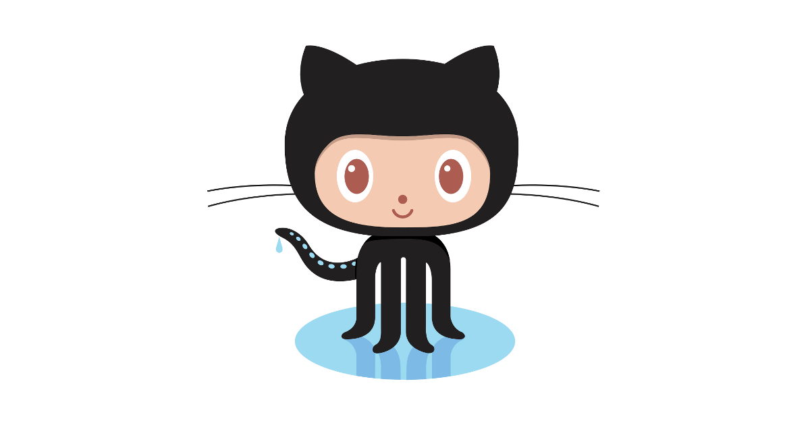
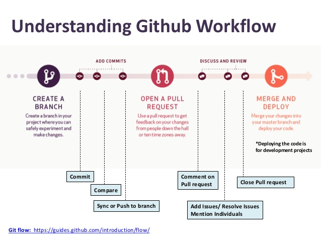

# Glossary

### Repository

A repository is the most basic element of GitHub. It is easiest to imagine as a project's folder. A repository contains all of the project files (including documentation), and stores each file's revision history. Repositories can have multiple collaborators and can be either public or private.

### Commit

A commit, or "revision", is an individual change to a file (or set of files). It's like when you save a file, except with Git, every time you save it creates a unique ID (a.k.a. the "SHA" or "hash") that allows you to keep record of what changes were made when and by who. Commits usually contain a commit message which is a description of changes made.

### Branch

A branch is a parallel version of a repository. It is contained within the repository, but does not affect the primary or master branch allowing you to work freely without disrupting the "live" version. When you've made the changes you want to make, you can merge your branch back into the master branch to publish your changes.

### Merge

Merging takes the changes from one branch (in the same repository or from a fork), and applies them into another. This often happens as a pull request (which can be thought of as a request to merge), or via the command line. A merge can be done automatically via a pull request via the GitHub web interface if there are no conflicting changes, or can always be done via the command line. For more information, see ["Merging a pull request."](https://help.github.com/articles/merging-a-pull-request){:target="_blank"}

### Push

Pushing refers to sending your committed changes to a remote repository, such as a repository hosted on GitHub. For instance, if you change something locally, you'd want to then push those changes so that others may access them.

### Pull Request

Pull requests are proposed changes to a repository submitted by a user and accepted or rejected by a repository's collaborators. Like issues, pull requests each have their own discussion forum. For more information, see ["About pull requests."](https://help.github.com/articles/about-pull-requests){:target="_blank"}

### Pull

Pull refers to when you are fetching in changes and merging them. For instance, if someone has edited the remote file you're both working on, you'll want to pull in those changes to your local copy so that it's up to date.

### Fork

A fork is a personal copy of another user's repository that lives on your account. Forks allow you to freely make changes to a project without affecting the original. Forks remain attached to the original, allowing you to submit a pull request to the original author to update with your changes. You can also keep your fork up to date by pulling in updates from the original.

### Clone

A clone is a copy of a repository that lives on your computer instead of on a website's server somewhere, or the act of making that copy. With your clone you can edit the files in your preferred editor and use Git to keep track of your changes without having to be online. It is, however, connected to the remote version so that changes can be synced between the two. You can push your local changes to the [remote](https://help.github.com/articles/github-glossary/#remote){:target="_blank"} to keep them synced when you're online.

### Fetch

Fetching refers to getting the latest changes from an online repository without merging them in. Once these changes are fetched you can compare them to your local branches (the code residing on your local machine).

### Diff

A diff is the difference in changes between two commits, or saved changes. The diff will visually describe what was added or removed from a file since its last commit.

### Contributor

A contributor is someone who has contributed to a project by having a pull request merged but does not have collaborator access.

### Markdown

Markdown is a simple semantic file format, not too dissimilar from .doc, .rtf and .txt. Markdown makes it easy for even those without a web-publishing background to write prose (including with links, lists, bullets, etc.) and have it displayed like a website. GitHub supports Markdown, and you can [learn about the semantics.](https://help.github.com/categories/writing-on-github/){:target="_blank"}

[NEXT STEP: Earn a Workshop Badge](informal-credentials.html){: .btn .btn-blue }
